# [📈 Live Status](https://sahajananddigital.github.io/status): <!--live status--> **🟧 Partial outage**

This repository contains the open-source uptime monitor and status page for [Sahajanand Digital](https://sahajananddigital.in), powered by [Upptime](https://github.com/upptime/upptime).

With [Upptime](https://upptime.js.org), you can get your own unlimited and free uptime monitor and status page, powered entirely by a GitHub repository. We use [Issues](https://github.com/sahajananddigital/status/issues) as incident reports, [Actions](https://github.com/sahajananddigital/status/actions) as uptime monitors, and [Pages](https://sahajananddigital.github.io/status) for the status page.

<!--start: status pages-->
<!-- This summary is generated by Upptime (https://github.com/upptime/upptime) -->
<!-- Do not edit this manually, your changes will be overwritten -->
<!-- prettier-ignore -->
| URL | Status | History | Response Time | Uptime |
| --- | ------ | ------- | ------------- | ------ |
|  [Sahajananad Digital](https://sahajananddigital.in) | 🟩 Up | [sahajananad-digital.yml](https://github.com/sahajananddigital/status/commits/HEAD/history/sahajananad-digital.yml) | 

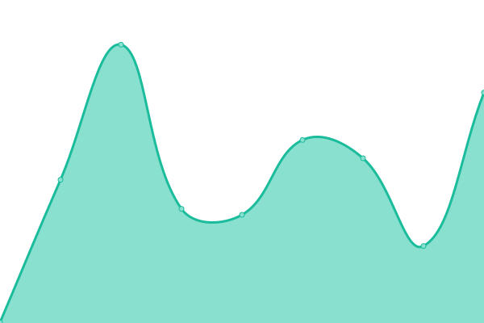 140ms
     
 | 

<a href="https://status.sahajananddigital.in/history/sahajananad-digital">100.00%</a>
    

|  [Aquapex Ro](https://aquapexro.in) | 🟩 Up | [aquapex-ro.yml](https://github.com/sahajananddigital/status/commits/HEAD/history/aquapex-ro.yml) | 

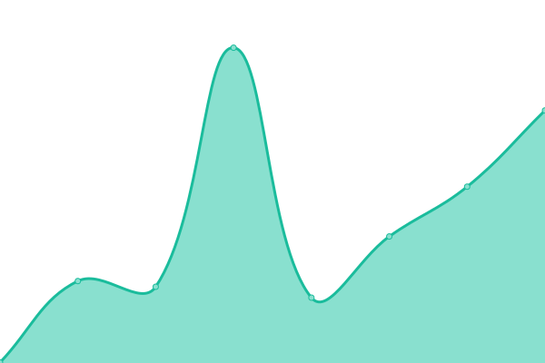 256ms
     
 | 

<a href="https://status.sahajananddigital.in/history/aquapex-ro">100.00%</a>
    

|  [Evon Stone Ceramics](https://evonceramics.com) | 🟩 Up | [evon-stone-ceramics.yml](https://github.com/sahajananddigital/status/commits/HEAD/history/evon-stone-ceramics.yml) | 

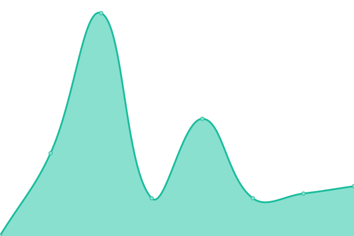 2255ms
     
 | 

<a href="https://status.sahajananddigital.in/history/evon-stone-ceramics">100.00%</a>
    

|  [Evon Stone](https://evonstone.com) | 🟩 Up | [evon-stone.yml](https://github.com/sahajananddigital/status/commits/HEAD/history/evon-stone.yml) | 

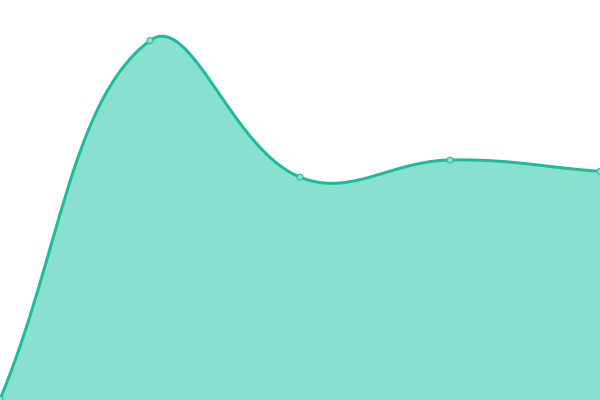 971ms
     
 | 

<a href="https://status.sahajananddigital.in/history/evon-stone">96.82%</a>
    

|  [Sahajanand Projects](https://projects.sahajananddigital.in) | 🟩 Up | [sahajanand-projects.yml](https://github.com/sahajananddigital/status/commits/HEAD/history/sahajanand-projects.yml) | 

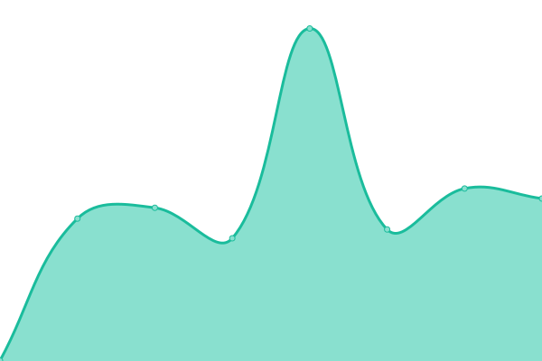 498ms
     
 | 

<a href="https://status.sahajananddigital.in/history/sahajanand-projects">100.00%</a>
    

|  [Vedik Gurukulam](https://vedikgurukulam.org) | 🟩 Up | [vedik-gurukulam.yml](https://github.com/sahajananddigital/status/commits/HEAD/history/vedik-gurukulam.yml) | 

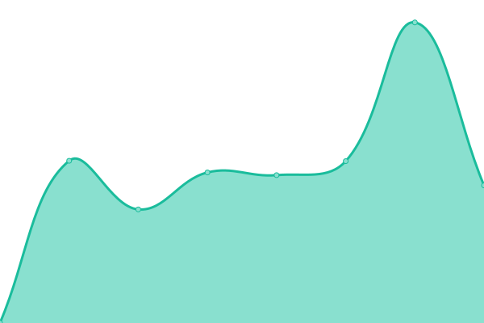 939ms
     
 | 

<a href="https://status.sahajananddigital.in/history/vedik-gurukulam">100.00%</a>
    

|  [Sidhhatva Accountants LLP](https://siddhatvaaccountants.com) | 🟩 Up | [sidhhatva-accountants-llp.yml](https://github.com/sahajananddigital/status/commits/HEAD/history/sidhhatva-accountants-llp.yml) | 

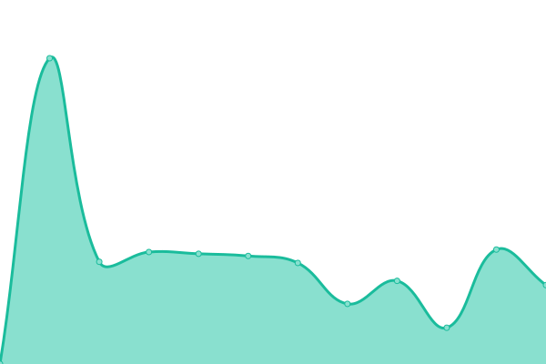 864ms
     
 | 

<a href="https://status.sahajananddigital.in/history/sidhhatva-accountants-llp">100.00%</a>
    

|  [Shrihari Charitra](https://shriharicharitra.com) | 🟩 Up | [shrihari-charitra.yml](https://github.com/sahajananddigital/status/commits/HEAD/history/shrihari-charitra.yml) | 

 532ms
     
 | 

<a href="https://status.sahajananddigital.in/history/shrihari-charitra">100.00%</a>
    

|  [Harshi Impex](https://www.harshiimpex.com) | 🟩 Up | [harshi-impex.yml](https://github.com/sahajananddigital/status/commits/HEAD/history/harshi-impex.yml) | 

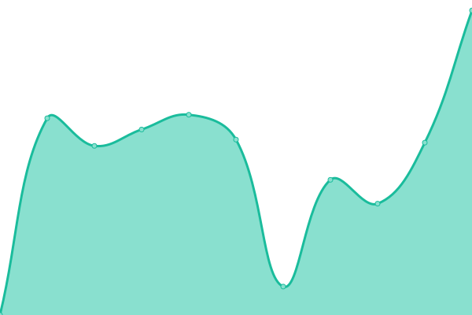 1716ms
     
 | 

<a href="https://status.sahajananddigital.in/history/harshi-impex">100.00%</a>
    

|  [Nano Polycoat](https://nanopolycoat.com) | 🟩 Up | [nano-polycoat.yml](https://github.com/sahajananddigital/status/commits/HEAD/history/nano-polycoat.yml) | 

 1189ms
     
 | 

<a href="https://status.sahajananddigital.in/history/nano-polycoat">96.52%</a>
    

|  [Harikrusna International](https://shreeharikrushnaintl.com) | 🟩 Up | [harikrusna-international.yml](https://github.com/sahajananddigital/status/commits/HEAD/history/harikrusna-international.yml) | 

 698ms
     
 | 

<a href="https://status.sahajananddigital.in/history/harikrusna-international">100.00%</a>
    

|  [codecurateurs.com ( Achal )](https://codecurateurs.com) | 🟥 Down | [codecurateurs-com-achal.yml](https://github.com/sahajananddigital/status/commits/HEAD/history/codecurateurs-com-achal.yml) | 

 1533ms
     
 | 

<a href="https://status.sahajananddigital.in/history/codecurateurs-com-achal">0.00%</a>
    

|  [Advance Dye Chem](https://advancedyechem.com) | 🟩 Up | [advance-dye-chem.yml](https://github.com/sahajananddigital/status/commits/HEAD/history/advance-dye-chem.yml) | 

 885ms
     
 | 

<a href="https://status.sahajananddigital.in/history/advance-dye-chem">100.00%</a>
    

|  [LeosonPharma.com ( WalArt Pharma )](https://leosonpharma.com) | 🟩 Up | [leoson-pharma-com-wal-art-pharma.yml](https://github.com/sahajananddigital/status/commits/HEAD/history/leoson-pharma-com-wal-art-pharma.yml) | 

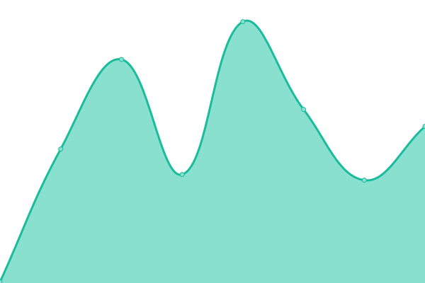 911ms
     
 | 

<a href="https://status.sahajananddigital.in/history/leoson-pharma-com-wal-art-pharma">99.83%</a>
    

|  [walartpharma.in ( WalArt Pharma )](https://walartpharma.in) | 🟥 Down | [walartpharma-in-wal-art-pharma.yml](https://github.com/sahajananddigital/status/commits/HEAD/history/walartpharma-in-wal-art-pharma.yml) | 

 382ms
     
 | 

<a href="https://status.sahajananddigital.in/history/walartpharma-in-wal-art-pharma">99.00%</a>
    

|  [megmahealth.com ( WalArt Pharma )](https://megmahealth.com) | 🟩 Up | [megmahealth-com-wal-art-pharma.yml](https://github.com/sahajananddigital/status/commits/HEAD/history/megmahealth-com-wal-art-pharma.yml) | 

 387ms
     
 | 

<a href="https://status.sahajananddigital.in/history/megmahealth-com-wal-art-pharma">100.00%</a>
    

|  [RelyCore Solutions](https://relycoresolutions.com) | 🟩 Up | [rely-core-solutions.yml](https://github.com/sahajananddigital/status/commits/HEAD/history/rely-core-solutions.yml) | 

 1143ms
     
 | 

<a href="https://status.sahajananddigital.in/history/rely-core-solutions">100.00%</a>
    

|  [Prevail Engineering](https://prevailengg.com) | 🟩 Up | [prevail-engineering.yml](https://github.com/sahajananddigital/status/commits/HEAD/history/prevail-engineering.yml) | 

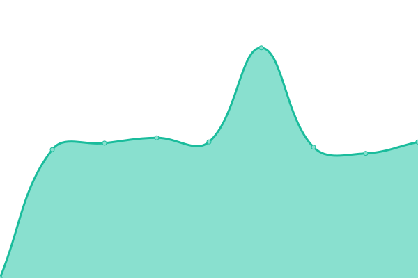 3257ms
     
 | 

<a href="https://status.sahajananddigital.in/history/prevail-engineering">100.00%</a>
    

|  [Prasham Industries](https://prashamindustries.com) | 🟩 Up | [prasham-industries.yml](https://github.com/sahajananddigital/status/commits/HEAD/history/prasham-industries.yml) | 

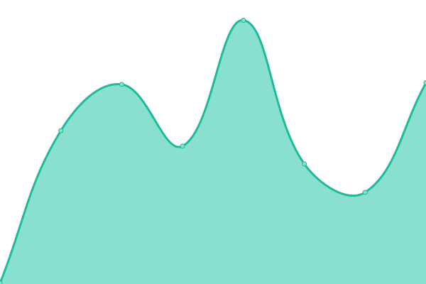 898ms
     
 | 

<a href="https://status.sahajananddigital.in/history/prasham-industries">100.00%</a>
    

|  [Shiksha Skills Institute](http://shikshaskills.org.in) | 🟩 Up | [shiksha-skills-institute.yml](https://github.com/sahajananddigital/status/commits/HEAD/history/shiksha-skills-institute.yml) | 

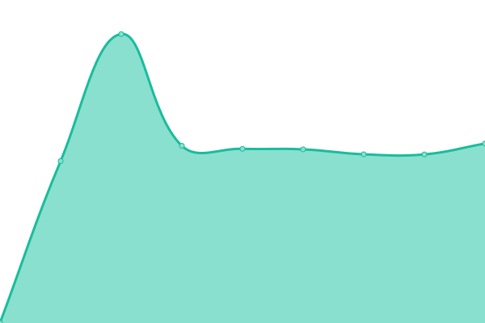 2792ms
     
 | 

<a href="https://status.sahajananddigital.in/history/shiksha-skills-institute">100.00%</a>
    

<!--end: status pages-->

[**Visit our status website →**](https://sahajananddigital.github.io/status)

## 📄 License

- Powered by: [Upptime](https://github.com/upptime/upptime)
- Code: [MIT](./LICENSE) © [Sahajanand Digital](https://sahajananddigital.in)
- Data in the `./history` directory: [Open Database License](https://opendatacommons.org/licenses/odbl/1-0/)
