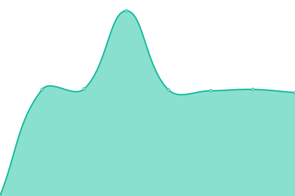

# [📈 Live Status](https://sahajananddigital.github.io/status): <!--live status--> **🟧 Partial outage**

This repository contains the open-source uptime monitor and status page for [Sahajanand Digital](https://sahajananddigital.in), powered by [Upptime](https://github.com/upptime/upptime).

With [Upptime](https://upptime.js.org), you can get your own unlimited and free uptime monitor and status page, powered entirely by a GitHub repository. We use [Issues](https://github.com/sahajananddigital/status/issues) as incident reports, [Actions](https://github.com/sahajananddigital/status/actions) as uptime monitors, and [Pages](https://sahajananddigital.github.io/status) for the status page.

<!--start: status pages-->
<!-- This summary is generated by Upptime (https://github.com/upptime/upptime) -->
<!-- Do not edit this manually, your changes will be overwritten -->
<!-- prettier-ignore -->
| URL | Status | History | Response Time | Uptime |
| --- | ------ | ------- | ------------- | ------ |
|  [Sahajananad Digital](https://sahajananddigital.in) | 🟩 Up | [sahajananad-digital.yml](https://github.com/sahajananddigital/status/commits/HEAD/history/sahajananad-digital.yml) | 

 154ms
     
 | 

<a href="https://status.sahajananddigital.in/history/sahajananad-digital">100.00%</a>
    

|  [Aquapex Ro](https://aquapexro.in) | 🟩 Up | [aquapex-ro.yml](https://github.com/sahajananddigital/status/commits/HEAD/history/aquapex-ro.yml) | 

 90ms
     
 | 

<a href="https://status.sahajananddigital.in/history/aquapex-ro">100.00%</a>
    

|  [Clear Books Kpo](https://clearbookskpo.com) | 🟥 Down | [clear-books-kpo.yml](https://github.com/sahajananddigital/status/commits/HEAD/history/clear-books-kpo.yml) | 

 0ms
     
 | 

<a href="https://status.sahajananddigital.in/history/clear-books-kpo">0.00%</a>
    

|  [Aquafinest Ro ( Gajanan Praskar )](https://aquafinestro.com) | 🟩 Up | [aquafinest-ro-gajanan-praskar.yml](https://github.com/sahajananddigital/status/commits/HEAD/history/aquafinest-ro-gajanan-praskar.yml) | 

 4351ms
     
 | 

<a href="https://status.sahajananddigital.in/history/aquafinest-ro-gajanan-praskar">100.00%</a>
    

|  [Evon Stone Ceramics](https://evonceramics.com) | 🟩 Up | [evon-stone-ceramics.yml](https://github.com/sahajananddigital/status/commits/HEAD/history/evon-stone-ceramics.yml) | 

 380ms
     
 | 

<a href="https://status.sahajananddigital.in/history/evon-stone-ceramics">100.00%</a>
    

|  [Trovalabels](https://trovalabels.com) | 🟩 Up | [trovalabels.yml](https://github.com/sahajananddigital/status/commits/HEAD/history/trovalabels.yml) | 

 2214ms
     
 | 

<a href="https://status.sahajananddigital.in/history/trovalabels">100.00%</a>
    

|  [I Energy Pharmacophore LLP ( Samir Savaliya )](https://ienergypl.com) | 🟩 Up | [i-energy-pharmacophore-llp-samir-savaliya.yml](https://github.com/sahajananddigital/status/commits/HEAD/history/i-energy-pharmacophore-llp-samir-savaliya.yml) | 

 1830ms
     
 | 

<a href="https://status.sahajananddigital.in/history/i-energy-pharmacophore-llp-samir-savaliya">100.00%</a>
    

|  [Bhgavati Generators](https://bhagvatigenerators.com) | 🟩 Up | [bhgavati-generators.yml](https://github.com/sahajananddigital/status/commits/HEAD/history/bhgavati-generators.yml) | 

 2111ms
     
 | 

<a href="https://status.sahajananddigital.in/history/bhgavati-generators">100.00%</a>
    

|  [Evvara Canada](https://evvara.ca) | 🟩 Up | [evvara-canada.yml](https://github.com/sahajananddigital/status/commits/HEAD/history/evvara-canada.yml) | 

 326ms
     
 | 

<a href="https://status.sahajananddigital.in/history/evvara-canada">100.00%</a>
    

<!--end: status pages-->

[**Visit our status website →**](https://sahajananddigital.github.io/status)

## 📄 License

- Powered by: [Upptime](https://github.com/upptime/upptime)
- Code: [MIT](./LICENSE) © [Sahajanand Digital](https://sahajananddigital.in)
- Data in the `./history` directory: [Open Database License](https://opendatacommons.org/licenses/odbl/1-0/)
