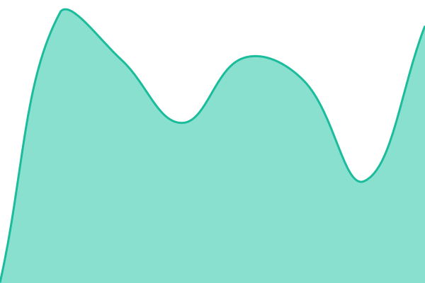
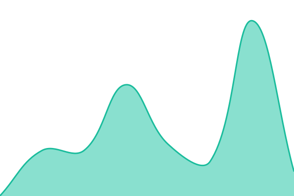
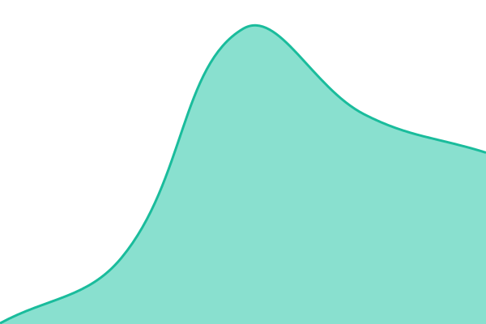
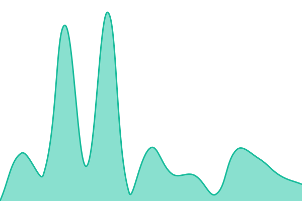
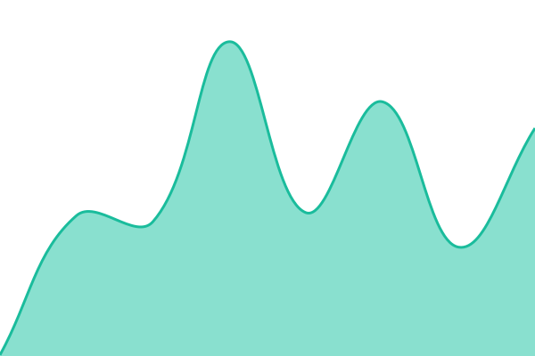
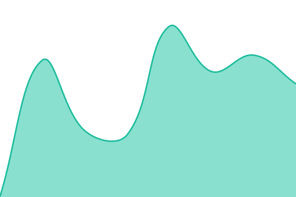
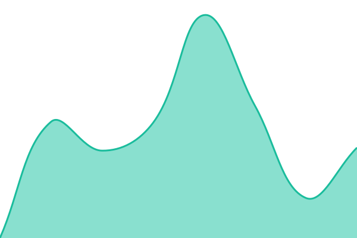
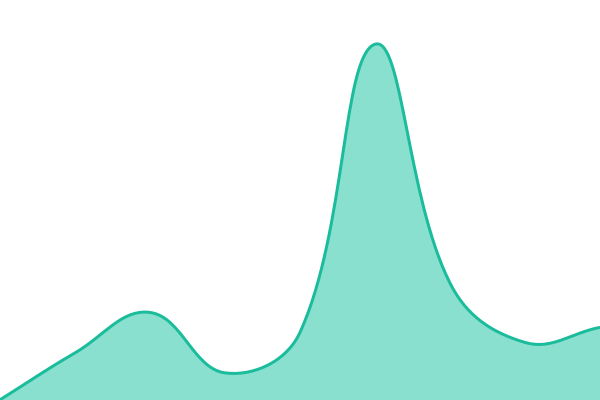
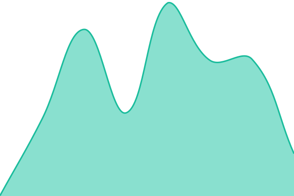

# [📈 Live Status](https://sahajananddigital.github.io/status): <!--live status--> **🟧 Partial outage**

This repository contains the open-source uptime monitor and status page for [Sahajanand Digital](https://sahajananddigital.in), powered by [Upptime](https://github.com/upptime/upptime).

With [Upptime](https://upptime.js.org), you can get your own unlimited and free uptime monitor and status page, powered entirely by a GitHub repository. We use [Issues](https://github.com/sahajananddigital/status/issues) as incident reports, [Actions](https://github.com/sahajananddigital/status/actions) as uptime monitors, and [Pages](https://sahajananddigital.github.io/status) for the status page.

<!--start: status pages-->
<!-- This summary is generated by Upptime (https://github.com/upptime/upptime) -->
<!-- Do not edit this manually, your changes will be overwritten -->
<!-- prettier-ignore -->
| URL | Status | History | Response Time | Uptime |
| --- | ------ | ------- | ------------- | ------ |
|  [Sahajananad Digital](https://sahajananddigital.in) | 🟥 Down | [sahajananad-digital.yml](https://github.com/sahajananddigital/status/commits/HEAD/history/sahajananad-digital.yml) | 

 3093ms
     
 | 

<a href="https://status.sahajananddigital.in/history/sahajananad-digital">99.80%</a>
    

|  [Aquapex Ro](https://aquapexro.in) | 🟩 Up | [aquapex-ro.yml](https://github.com/sahajananddigital/status/commits/HEAD/history/aquapex-ro.yml) | 

 446ms
     
 | 

<a href="https://status.sahajananddigital.in/history/aquapex-ro">100.00%</a>
    

|  [Sahajanand Projects](https://projects.sahajananddigital.in) | 🟥 Down | [sahajanand-projects.yml](https://github.com/sahajananddigital/status/commits/HEAD/history/sahajanand-projects.yml) | 

 3003ms
     
 | 

<a href="https://status.sahajananddigital.in/history/sahajanand-projects">99.81%</a>
    

|  [Sahajanand Server](https://server.sahajananddigital.in) | 🟥 Down | [sahajanand-server.yml](https://github.com/sahajananddigital/status/commits/HEAD/history/sahajanand-server.yml) | 

 943ms
     
 | 

<a href="https://status.sahajananddigital.in/history/sahajanand-server">99.85%</a>
    

|  [Vedik Gurukulam](https://vedikgurukulam.org) | 🟥 Down | [vedik-gurukulam.yml](https://github.com/sahajananddigital/status/commits/HEAD/history/vedik-gurukulam.yml) | 

 3469ms
     
 | 

<a href="https://status.sahajananddigital.in/history/vedik-gurukulam">99.87%</a>
    

|  [Sidhhatva Accountants LLP](https://siddhatvaaccountants.com) | 🟥 Down | [sidhhatva-accountants-llp.yml](https://github.com/sahajananddigital/status/commits/HEAD/history/sidhhatva-accountants-llp.yml) | 

 1787ms
     
 | 

<a href="https://status.sahajananddigital.in/history/sidhhatva-accountants-llp">99.88%</a>
    

|  [Shrihari Charitra](https://shriharicharitra.com) | 🟥 Down | [shrihari-charitra.yml](https://github.com/sahajananddigital/status/commits/HEAD/history/shrihari-charitra.yml) | 

 3007ms
     
 | 

<a href="https://status.sahajananddigital.in/history/shrihari-charitra">99.89%</a>
    

|  [Harikrusna International](https://shreeharikrushnaintl.com) | 🟥 Down | [harikrusna-international.yml](https://github.com/sahajananddigital/status/commits/HEAD/history/harikrusna-international.yml) | 

 2969ms
     
 | 

<a href="https://status.sahajananddigital.in/history/harikrusna-international">99.90%</a>
    

|  [Livohill.com ( Livohill Pharma )](https://livohil.com/) | 🟩 Up | [livohill-com-livohill-pharma.yml](https://github.com/sahajananddigital/status/commits/HEAD/history/livohill-com-livohill-pharma.yml) | 

 212ms
     
 | 

<a href="https://status.sahajananddigital.in/history/livohill-com-livohill-pharma">100.00%</a>
    

|  [LeosonPharma.com ( WalArt Pharma )](https://leosonpharma.com) | 🟩 Up | [leoson-pharma-com-wal-art-pharma.yml](https://github.com/sahajananddigital/status/commits/HEAD/history/leoson-pharma-com-wal-art-pharma.yml) | 

 225ms
     
 | 

<a href="https://status.sahajananddigital.in/history/leoson-pharma-com-wal-art-pharma">100.00%</a>
    

|  [megmahealth.com ( WalArt Pharma )](https://megmahealth.com) | 🟩 Up | [megmahealth-com-wal-art-pharma.yml](https://github.com/sahajananddigital/status/commits/HEAD/history/megmahealth-com-wal-art-pharma.yml) | 

 146ms
     
 | 

<a href="https://status.sahajananddigital.in/history/megmahealth-com-wal-art-pharma">100.00%</a>
    

|  [RelyCore Solutions](https://relycoresolutions.com) | 🟥 Down | [rely-core-solutions.yml](https://github.com/sahajananddigital/status/commits/HEAD/history/rely-core-solutions.yml) | 

 4943ms
     
 | 

<a href="https://status.sahajananddigital.in/history/rely-core-solutions">99.91%</a>
    

|  [Prevail Engineering](https://prevailengg.com) | 🟥 Down | [prevail-engineering.yml](https://github.com/sahajananddigital/status/commits/HEAD/history/prevail-engineering.yml) | 

 3679ms
     
 | 

<a href="https://status.sahajananddigital.in/history/prevail-engineering">99.92%</a>
    

|  [Prasham Industries](https://prashamindustries.com) | 🟩 Up | [prasham-industries.yml](https://github.com/sahajananddigital/status/commits/HEAD/history/prasham-industries.yml) | 

 188ms
     
 | 

<a href="https://status.sahajananddigital.in/history/prasham-industries">100.00%</a>
    

|  [Shiksha Skills Institute](http://shikshaskills.org.in) | 🟥 Down | [shiksha-skills-institute.yml](https://github.com/sahajananddigital/status/commits/HEAD/history/shiksha-skills-institute.yml) | 

 3827ms
     
 | 

<a href="https://status.sahajananddigital.in/history/shiksha-skills-institute">99.93%</a>
    

|  [Saurya Technology](https://sauryatechnology.com) | 🟥 Down | [saurya-technology.yml](https://github.com/sahajananddigital/status/commits/HEAD/history/saurya-technology.yml) | 

 3002ms
     
 | 

<a href="https://status.sahajananddigital.in/history/saurya-technology">99.95%</a>
    

|  [Marvel Impex](https://marvelimpexindia.com/) | 🟩 Up | [marvel-impex.yml](https://github.com/sahajananddigital/status/commits/HEAD/history/marvel-impex.yml) | 

 222ms
     
 | 

<a href="https://status.sahajananddigital.in/history/marvel-impex">100.00%</a>
    

|  [AksharLife Science](https://aksharlifescience.com) | 🟥 Down | [akshar-life-science.yml](https://github.com/sahajananddigital/status/commits/HEAD/history/akshar-life-science.yml) | 

 5436ms
     
 | 

<a href="https://status.sahajananddigital.in/history/akshar-life-science">99.96%</a>
    

|  [BizzyBites](https://bizzybites.in) | 🟥 Down | [bizzy-bites.yml](https://github.com/sahajananddigital/status/commits/HEAD/history/bizzy-bites.yml) | 

 3890ms
     
 | 

<a href="https://status.sahajananddigital.in/history/bizzy-bites">99.97%</a>
    

|  [Sidhhatva Accountants LLP](https://saglobus.com) | 🟥 Down | [sidhhatva-accountants-llp.yml](https://github.com/sahajananddigital/status/commits/HEAD/history/sidhhatva-accountants-llp.yml) | 

 1787ms
     
 | 

<a href="https://status.sahajananddigital.in/history/sidhhatva-accountants-llp">99.87%</a>
    

|  [Royal Sahara LLC](https://royalsaharallc.com) | 🟥 Down | [royal-sahara-llc.yml](https://github.com/sahajananddigital/status/commits/HEAD/history/royal-sahara-llc.yml) | 

 3058ms
     
 | 

<a href="https://status.sahajananddigital.in/history/royal-sahara-llc">99.99%</a>
    

<!--end: status pages-->

[**Visit our status website →**](https://sahajananddigital.github.io/status)

## 📄 License

- Powered by: [Upptime](https://github.com/upptime/upptime)
- Code: [MIT](./LICENSE) © [Sahajanand Digital](https://sahajananddigital.in)
- Data in the `./history` directory: [Open Database License](https://opendatacommons.org/licenses/odbl/1-0/)
