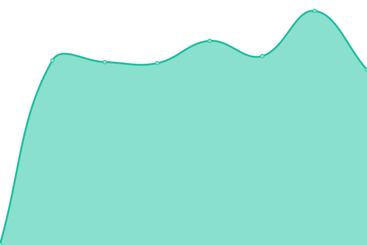

# [📈 Live Status](https://sahajananddigital.github.io/status): <!--live status--> **🟩 All systems operational**

This repository contains the open-source uptime monitor and status page for [Sahajanand Digital](https://sahajananddigital.in), powered by [Upptime](https://github.com/upptime/upptime).

With [Upptime](https://upptime.js.org), you can get your own unlimited and free uptime monitor and status page, powered entirely by a GitHub repository. We use [Issues](https://github.com/sahajananddigital/status/issues) as incident reports, [Actions](https://github.com/sahajananddigital/status/actions) as uptime monitors, and [Pages](https://sahajananddigital.github.io/status) for the status page.

<!--start: status pages-->
<!-- This summary is generated by Upptime (https://github.com/upptime/upptime) -->
<!-- Do not edit this manually, your changes will be overwritten -->
<!-- prettier-ignore -->
| URL | Status | History | Response Time | Uptime |
| --- | ------ | ------- | ------------- | ------ |
|  [Sahajananad Digital](https://sahajananddigital.in) | 🟩 Up | [sahajananad-digital.yml](https://github.com/sahajananddigital/status/commits/HEAD/history/sahajananad-digital.yml) | 

 87ms
     
 | 

<a href="https://status.sahajananddigital.in/history/sahajananad-digital">100.00%</a>
    

|  [Aquapex Ro](https://aquapexro.in) | 🟩 Up | [aquapex-ro.yml](https://github.com/sahajananddigital/status/commits/HEAD/history/aquapex-ro.yml) | 

 135ms
     
 | 

<a href="https://status.sahajananddigital.in/history/aquapex-ro">100.00%</a>
    

|  [Aquafinest Ro ( Gajanan Praskar )](https://aquafinestro.com) | 🟩 Up | [aquafinest-ro-gajanan-praskar.yml](https://github.com/sahajananddigital/status/commits/HEAD/history/aquafinest-ro-gajanan-praskar.yml) | 

 516ms
     
 | 

<a href="https://status.sahajananddigital.in/history/aquafinest-ro-gajanan-praskar">100.00%</a>
    

|  [Evon Stone Ceramics](https://evonceramics.com) | 🟩 Up | [evon-stone-ceramics.yml](https://github.com/sahajananddigital/status/commits/HEAD/history/evon-stone-ceramics.yml) | 

 496ms
     
 | 

<a href="https://status.sahajananddigital.in/history/evon-stone-ceramics">99.84%</a>
    

|  [Evon Stone Ceramics](https://evonstone.com) | 🟩 Up | [evon-stone-ceramics.yml](https://github.com/sahajananddigital/status/commits/HEAD/history/evon-stone-ceramics.yml) | 

 496ms
     
 | 

<a href="https://status.sahajananddigital.in/history/evon-stone-ceramics">99.84%</a>
    

|  [I Energy Pharmacophore LLP ( Samir Savaliya )](https://ienergypl.com) | 🟩 Up | [i-energy-pharmacophore-llp-samir-savaliya.yml](https://github.com/sahajananddigital/status/commits/HEAD/history/i-energy-pharmacophore-llp-samir-savaliya.yml) | 

 1245ms
     
 | 

<a href="https://status.sahajananddigital.in/history/i-energy-pharmacophore-llp-samir-savaliya">100.00%</a>
    

|  [Sahajanand Projects](https://projects.sahajananddigital.in) | 🟩 Up | [sahajanand-projects.yml](https://github.com/sahajananddigital/status/commits/HEAD/history/sahajanand-projects.yml) | 

 340ms
     
 | 

<a href="https://status.sahajananddigital.in/history/sahajanand-projects">100.00%</a>
    

|  [Vedik Gurukulam](https://vedikgurukulam.org) | 🟩 Up | [vedik-gurukulam.yml](https://github.com/sahajananddigital/status/commits/HEAD/history/vedik-gurukulam.yml) | 

 599ms
     
 | 

<a href="https://status.sahajananddigital.in/history/vedik-gurukulam">100.00%</a>
    

|  [Sidhhatva Accountants LLP](https://siddhatvaaccountants.com) | 🟩 Up | [sidhhatva-accountants-llp.yml](https://github.com/sahajananddigital/status/commits/HEAD/history/sidhhatva-accountants-llp.yml) | 

 489ms
     
 | 

<a href="https://status.sahajananddigital.in/history/sidhhatva-accountants-llp">99.84%</a>
    

|  [Installdotsh.com ( Piyush Banugariya )](https://installdotsh.com) | 🟩 Up | [installdotsh-com-piyush-banugariya.yml](https://github.com/sahajananddigital/status/commits/HEAD/history/installdotsh-com-piyush-banugariya.yml) | 

 373ms
     
 | 

<a href="https://status.sahajananddigital.in/history/installdotsh-com-piyush-banugariya">100.00%</a>
    

|  [Shrihari Charitra](https://shriharicharitra.com) | 🟩 Up | [shrihari-charitra.yml](https://github.com/sahajananddigital/status/commits/HEAD/history/shrihari-charitra.yml) | 

 533ms
     
 | 

<a href="https://status.sahajananddigital.in/history/shrihari-charitra">99.67%</a>
    

|  [Harshi Impex](https://www.harshiimpex.com) | 🟩 Up | [harshi-impex.yml](https://github.com/sahajananddigital/status/commits/HEAD/history/harshi-impex.yml) | 

 1751ms
     
 | 

<a href="https://status.sahajananddigital.in/history/harshi-impex">99.67%</a>
    

|  [Nano Polycoat](https://nanopolycoat.com) | 🟩 Up | [nano-polycoat.yml](https://github.com/sahajananddigital/status/commits/HEAD/history/nano-polycoat.yml) | 

 1351ms
     
 | 

<a href="https://status.sahajananddigital.in/history/nano-polycoat">99.67%</a>
    

|  [Harikrusna International](https://shreeharikrushnaintl.com) | 🟩 Up | [harikrusna-international.yml](https://github.com/sahajananddigital/status/commits/HEAD/history/harikrusna-international.yml) | 

 1154ms
     
 | 

<a href="https://status.sahajananddigital.in/history/harikrusna-international">99.48%</a>
    

|  [codecurateurs.com ( Achal )](https://codecurateurs.com) | 🟩 Up | [codecurateurs-com-achal.yml](https://github.com/sahajananddigital/status/commits/HEAD/history/codecurateurs-com-achal.yml) | 

 523ms
     
 | 

<a href="https://status.sahajananddigital.in/history/codecurateurs-com-achal">100.00%</a>
    

|  [finepitchtech.com ( Sanjaybhai Hirani )](https://finepitchtech.com) | 🟩 Up | [finepitchtech-com-sanjaybhai-hirani.yml](https://github.com/sahajananddigital/status/commits/HEAD/history/finepitchtech-com-sanjaybhai-hirani.yml) | 

 1543ms
     
 | 

<a href="https://status.sahajananddigital.in/history/finepitchtech-com-sanjaybhai-hirani">99.67%</a>
    

|  [Advance Dye Chem](https://advancedyechem.com) | 🟩 Up | [advance-dye-chem.yml](https://github.com/sahajananddigital/status/commits/HEAD/history/advance-dye-chem.yml) | 

 1114ms
     
 | 

<a href="https://status.sahajananddigital.in/history/advance-dye-chem">99.67%</a>
    

<!--end: status pages-->

[**Visit our status website →**](https://sahajananddigital.github.io/status)

## 📄 License

- Powered by: [Upptime](https://github.com/upptime/upptime)
- Code: [MIT](./LICENSE) © [Sahajanand Digital](https://sahajananddigital.in)
- Data in the `./history` directory: [Open Database License](https://opendatacommons.org/licenses/odbl/1-0/)
